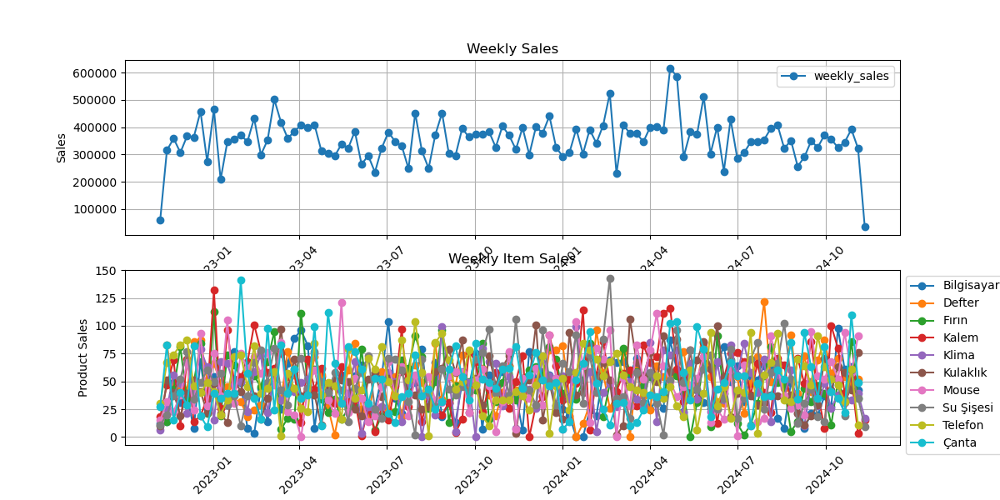
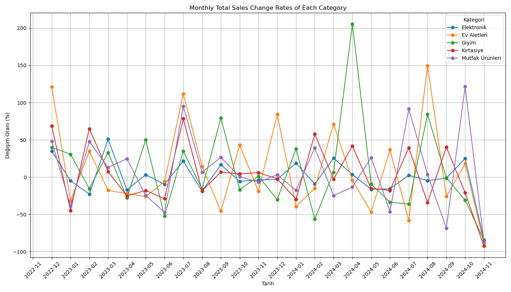
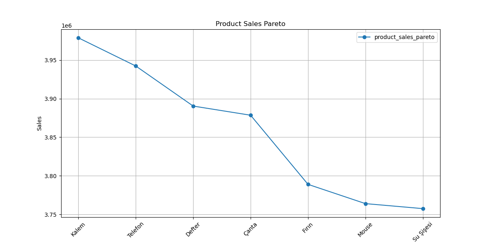
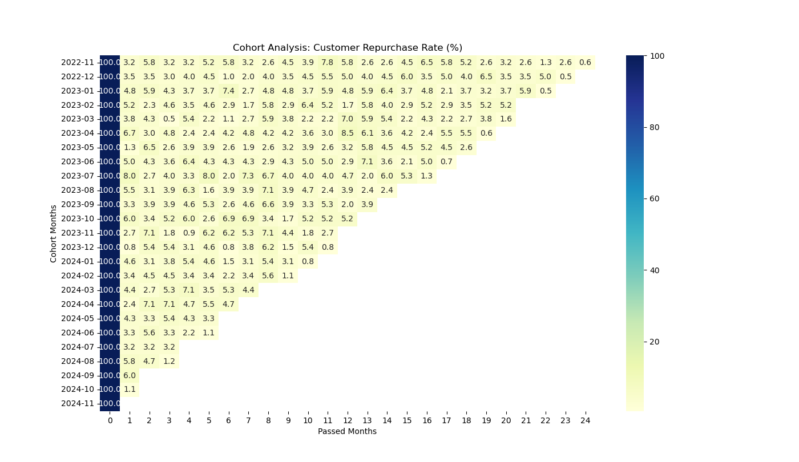
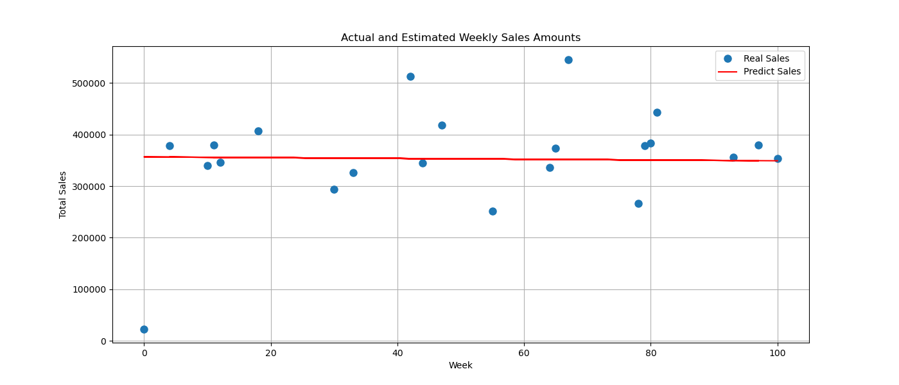

# Data Analysis Project

## Project Overview
This project was assigned as part of the Patika & NewMind AI Bootcamp. The main objective of this project is to practice data analysis by processing and analyzing customer and sales data sets created with randomly generated values.

The project covers the following key areas:
- **Data Cleaning and Processing**
- **Time Series Analysis**
- **Categorical and Numerical Analysis**
- **Advanced Data Processing**
- **Data Visualization**
- **Bonus Section**

## Technology and Environment Setup
The project was coded using the Python programming language. The required libraries for this project are listed in the 'env' folder:
- If you are using **Anaconda**, the `environment.yml` file can be used to create the necessary environment.
- For non-Anaconda users, the `environment_fh.yml` file can be used for relevant library versions.

## Data Sets
The data sets utilized in this project are located in the `datasets/base` folder. These include:
- **Customer Data**
- **Sales Data**

Both data sets have been prepared to simulate real-world data for the purpose of analysis.

## Task Document
The task details and requirements are documented in a `.docx` file, which is available in the project directory.

### Task 1: Data Cleaning and Processing

In this section, two datasets—`sales_df` (sales data) and `customer_df` (customer data)—were examined. The data cleaning and processing steps were carried out as follows:

#### **1.1. Data and Missing Value Check and Handling**

First, both datasets were loaded from CSV files, and the first few rows of the data were displayed:

- **Sales Data**: `sales_df`
- **Customer Data**: `customer_df`

The general structure and column information of each dataset were checked using the `.info()` function. Additionally, the frequency distribution of specific columns in each dataset, such as `ürün_adi`, `kategori` for the sales data, and `cinsiyet`, `yas` and `sehir`  for the customer data, was examined using `.value_counts()`. This step provided an overview of the distribution of categorical variables in both datasets.

- **Missing Value Handling**:
   - A custom function, `detect_is_numeric`, was implemented to ensure numeric columns (`fiyat` and `toplam_satis`) were properly converted to numeric types, addressing any non-numeric values.
   - Missing values in:
     - `toplam_satis` were filled with the product of `fiyat` and `adet`.
     - `fiyat` were filled using the ratio of `toplam_satis` to `adet`.

- **Data Consistency**:
   - A check was performed to ensure `toplam_satis` values matched the product of `fiyat` and `adet`. Any inconsistencies were corrected.

#### **1.2. Outlier Detection**

The **Interquartile Range (IQR)** method was used for outlier detection. This method identifies outliers by measuring the spread of the middle 50% of the data and flagging values that fall outside this range.

Outliers were searched in the following columns:
- **Customer Age**: `yas`
- **Customer Spending**: `harcama_miktari`
- **Sales Price**: `fiyat`
- **Total Sales**: `toplam_satis`
- **Sales Quantity**: `adet`

For each of these columns, the **lower and upper limits** (`low_limit`, `upp_limit`) were calculated, and outliers were flagged based on these bounds. The count of outliers and the corresponding limits were summarized. 

To prevent the outliers from distorting the dataset, the outliers in the `toplam_satis` and `fiyat` columns were adjusted to the upper limits. This step ensured that the data remained intact without the influence of extreme outliers.

#### **1.3. Merging Data**

Finally, the **Sales Data** and **Customer Data** were merged using the `"musteri_id"` column. This ensured that each sales record was associated with the corresponding customer information.

The merged dataset, `merged_df`, was created, and sample data was displayed. Also saved it as `merged_data.csv` in `datasets/custom` folder.

### Task 2: Time Series Analysis

This section focuses on analyzing the sales data over time, examining trends and patterns at both weekly and monthly levels. The analysis was divided into several parts as outlined below.

#### **2.1. Unique Values Analysis**

- **Unique Products**: A list of unique products in the dataset was retrieved using `unique()` on the `ürün_adi` column. This helps identify the distinct products that were sold.

- **Unique Categories**: A similar analysis was done on the `kategori` column to determine the different product categories.

- **Date Range**: The `tarih` column, which contains dates, was converted to `datetime` format to facilitate time-based analysis. The earliest and latest dates in the dataset were also determined to get the overall time span of the data.

#### **2.1.1. Weekly Sales Analysis**

- **Weekly Sales**: The total sales for each week were calculated by resampling the data on a weekly basis (`"W-Mon"`), summing the `toplam_satis` values for each week. This helps identify trends in sales over time on a weekly scale.

- **Weekly Item Sales**: The sales of each individual product were also calculated weekly by grouping the data by product name (`ürün_adi`) and resampling the data on a weekly basis. The `adet` column, representing the quantity sold, was summed for each product.

- **Graphing**: Two graphs were plotted:
  - The first graph shows the total weekly sales (`weekly_sales`).

  - The second graph shows weekly sales for each product (`weekly_item_sales`), enabling a comparison of the performance of different products over time.   
  

#### **2.1.2. Monthly Sales Analysis**

- **Monthly Sales**: Similar to the weekly analysis, total monthly sales were calculated by resampling the data on a monthly basis (`"ME"`) and summing the `toplam_satis` values.

- **Monthly Item Sales**: The total sales for each product were also calculated on a monthly basis, summing the `adet` values for each product.

- **Graphing**: Two graphs were plotted for the monthly sales analysis:
  - The first graph shows the total monthly sales (`monthly_sales`).
  - The second graph shows the monthly sales for each product (`monthly_item_sales`), providing insight into how each product performed across different months.    
  

#### **2.2. Additional Time Series Insights**

- **Monthly First and Last Days**: The first and last days of each month were determined using the `min()` and `max()` functions on the `tarih` column, grouped by month. This helps understand the time frame for each monthly period in the dataset.

- **Weekly Total Item Sales**: The total quantity of items sold each week was calculated by resampling the `adet` column on a weekly basis. This provides insights into weekly sales volume.

#### **Graphs**

Several graphs were created to visualize the results of the time series analysis:
- Weekly and monthly sales trends.
- Weekly and monthly sales trends for individual items.
- Total item sales on a weekly basis.   

The visualizations help identify trends and patterns in product sales over time, aiding in the understanding of business performance and sales strategies.

### Task 3: Categorical and Numerical Analysis

This section focuses on analyzing categorical data, including total sales by category, sales trends by age group, and sales trends by gender. The analysis is broken down into three parts as follows:

#### **3.1: Categorical Total Sales**

- **Categoric Sales**: The total sales for each product category were calculated by grouping the data by the `kategori` column and summing the `toplam_satis` values. This gives us an overview of how sales are distributed across different product categories.

- **Sales Proportions**: The proportion of total sales for each category was calculated by dividing each category’s sales by the overall sales and multiplying by 100. This percentage helps understand the share of each category in the total sales.

#### **3.2: Age Group Analysis**

- **Age Group Classification**: The dataset was divided into age groups using the `pd.cut()` function. The age groups are categorized as:
  - 18-25 years
  - 26-35 years
  - 36-50 years
  - 50+ years

- **Sales Trends by Age Group**: The total sales for each age group were calculated by grouping the data by `age_group` and summing the `toplam_satis` values. The proportion of total sales for each age group was then computed, providing insight into which age groups contribute the most to overall sales.

- **Categoric Sales Trends by Age Group**: Sales were broken down by both age group and product category. The total sales for each combination of age group and category were calculated and then expressed as a percentage of the overall sales. This shows which product categories are most popular within each age group.

  **Key Insights**:
  - The **Ev Aletleri** category is the highest for the 18-25 age group.
  - The **Kırtasiye** category is the highest for the 26-35 age group.
  - The **Giyim** category is the highest for the 36-50 age group.
  - The **Kozmetik** category is the highest for the 50+ age group.

#### **3.3: Sex Analysis**

- **Sales Trends by Gender**: Total sales for each gender were calculated by grouping the data by the `cinsiyet` column and summing the `toplam_satis` values. The proportion of total sales for each gender was then computed to understand the gender distribution in sales.

- **Categoric Sales Trends by Gender**: Similar to the age group analysis, sales were broken down by both gender and product category. The total sales for each combination of gender and category were calculated and then expressed as a percentage of the overall sales. This provides insight into the most popular product categories for each gender.

  **Key Insights**:
  - For **Erkek** (Male) customers, **Ev Aletleri** is the highest category.
  - For **Kadın** (Female) customers, **Kozmetik** is the highest category.

### **Key Takeaways**

- The **Ev Aletleri** category is popular among both younger (18-25) and male customers.
- **Kozmetik** is more popular among older customers (50+) and female customers.
- There is a diverse preference across different age groups and genders, highlighting the importance of targeting specific customer segments with tailored marketing strategies.

### Task 4: Advanced Data Manipulation

This section covers advanced data manipulation techniques, including city-based analysis, customer and city spending analysis, product sales growth, and category-wise sales analysis. Below are the key tasks performed:

#### **4.1.1: City-Based Analysis**

- **Spending by City**: The total spending (`harcama_miktari`) for each city was calculated by grouping the data by `sehir` (city). The results were then sorted in descending order to identify the cities with the highest total spending.

#### **4.1.2: Customer-City Analysis**

- **Maximum Spending by Customer in Each City**: The data was grouped by both `musteri_id` (customer ID) and `sehir` (city), and the total spending for each combination was calculated. We then identified the customer with the maximum spending in each city using the `idxmax()` function and extracted the corresponding spending values.
  
- **Customer and City Expenditure Data**: A new DataFrame was created to display the `Customer İd` and the corresponding `Amount of Expenditure` for the customer who spent the most in each city.

#### **4.2: Calculate the Average Sales Growth Rate for Each Product**

- **Monthly Product Sales**: The sales data for each product was grouped by month (`tarih`) column and product (`ürün_adi`). The total quantity sold (`adet`) for each product was then summed for each month.
  
- **Sales Growth Rate**: The percentage change in sales for each product was calculated using `pct_change()`. This rate represents the month-over-month growth rate for each product.
  
- **Average Sales Growth Rate**: The average sales growth rate for each product was calculated by grouping the sales growth rates by product and computing the mean.

#### **4.3: Monthly Total Sales and Change Analysis by Category**

- **Category Monthly Sales**: The total sales (`toplam_satis`) for each product category were calculated by grouping the data by month and category (`kategori`). The total sales for each category were then summed for each month.

- **Sales Change Rate by Category**: The percentage change in total sales for each category was calculated by using the `pct_change()` function. This change rate was then reset to make the data easier to visualize.
  
- **Monthly Sales Data by Category**: A separate DataFrame was created to hold the reset sales data, which was used for plotting graphs showing the total sales and the change rates for each category over time.

    - **Graphs**: Visualizations were created to show:
        - The **monthly total sales** for each category.
        
        - The **monthly change rates** for total sales in each category.
        

### **Key Takeaways**

- **Spending by City**: The city with the highest total spending was identified, providing insights into regional spending patterns.
- **Maximum Spending by Customer**: The customer with the highest spending in each city was identified, which can be useful for targeting high-value customers.
- **Product Sales Growth**: The average sales growth for each product helps understand which products are performing well over time.
- **Category Sales and Change Rates**: The analysis of monthly sales and change rates for each category provides insights into trends and patterns across different product categories.

### Task 5: Extra (Bonus)

This section covers additional analysis techniques, including Pareto analysis, cohort analysis, regression modeling, and RFM (Recency, Frequency, Monetary) analysis. Each task provides valuable insights into customer behavior, sales trends, and predictive modeling.

#### **5.1: Pareto Analysis (80/20 Rule)**

- **Pareto Analysis**: The total sales for each product were calculated and sorted in descending order. Using the 80/20 rule (Pareto principle), the analysis identifies the products that contribute to 80% of total sales. The cumulative sales were computed, and products were selected until the total sales reached 80%.
  
    - **Results**: The products contributing to 80% of the total sales are displayed. This analysis helps identify key products driving the majority of sales. These products are `Kalem, Telefon, Çanta, Defter, Fırın, Su Şişesi, Mouse`

    - **Visualization**: A graph (`product_sales_pareto`) is created to visualize the Pareto distribution of product sales.
    

#### **5.2: Cohort Analysis**

- **Cohort Creation**: Customers' first purchase date was identified, and a cohort month was assigned based on this date. This information was added to the new DataFrame and saved as .csv. The merged dataset, `merged_df_first_sale`, was created, and sample data was displayed. Also saved it as `merged_data_w_first_sale.csv` in `datasets/custom` folder. The sales data was then grouped by cohort month and sale month to calculate the number of active customers for each cohort.
  
- **Cohort Table**: A cohort table was created to calculate the percentage of customers making repeat purchases in subsequent months.

    - **Results**: A heatmap (`cohort_analysis_customer_repurchase_rate`) provides a visual representation of the repurchase rate for each cohort, showing customer retention trends over time.
    

#### **5.3: Basic Regression Model (Weekly Sales Prediction)**

- **Total Weekly Sales**: The total sales (`toplam_satis`) were aggregated by week. The sales data was used to train a simple linear regression model to predict weekly sales trends.

- **Modeling**: The data was split into training and testing sets. A linear regression model was trained using the weekly data to predict future sales.

    - **Model Performance**: The model's accuracy was evaluated using metrics such as:
      - Mean Absolute Error (MAE)
      - Mean Squared Error (MSE)
      - Root Mean Squared Error (RMSE)
      - R² Score (Goodness of fit)

    - **Results**: The regression model's errors and performance metrics are displayed, and a graph (`basic_reg_weekly_predict`) shows the predicted sales versus actual sales.
    

#### **5.4: RFM (Recency, Frequency, Monetary) Analysis**

- **RFM Metrics**: Recency, Frequency, and Monetary values were calculated for each customer:
  - **Recency**: The number of days since the customer's last purchase.
  - **Frequency**: The number of purchases made by the customer.
  - **Monetary**: The total sales amount spent by the customer.

- **RFM Scoring**: Customers were scored based on their Recency, Frequency, and Monetary values, with higher scores indicating more valuable customers. The scores were used to categorize customers into segments such as `Champions, Loyal Customers, and At Risk.`

    - **Results**: A summary of the RFM analysis and the customer segments is displayed. Customers are classified into different segments based on their RFM scores, which helps identify the most valuable and at-risk customers.

    - **Frequent Customers**: The analysis also highlights "Loyal Customers," who are frequent buyers with high monetary values.

### **Key Takeaways**

- **Pareto Analysis**: Identifying the top products that contribute the most to sales helps prioritize efforts on high-performing items.
- **Cohort Analysis**: This provides insights into customer retention, showing how many customers make repeat purchases over time.
- **Regression Model**: The model helps predict future sales trends, providing a basic forecast for business planning.
- **RFM Analysis**: The segmentation of customers based on their behavior allows for targeted marketing and personalized strategies to increase customer loyalty.

## Conclusion

This analysis provided valuable insights into the sales patterns, customer behaviors, and product performance of the company through various techniques including city-based sales analysis, cohort analysis, Pareto analysis, and more. The following key takeaways can be made from the findings:

1. **City-Based Analysis**:
   - By analyzing total expenditures grouped by city, we identified which cities contributed the most to the overall sales. This information is crucial for targeted marketing efforts and can guide decisions on where to allocate resources for customer engagement and expansion.

2. **Customer-City Spending Insights**:
   - We identified the highest-spending customers in each city. This customer-city combination is important for tailored marketing strategies and ensuring the most profitable customers are well-served.

3. **Product Sales Growth**:
   - The analysis of monthly sales growth for each product revealed the average sales growth trends. This data is valuable for inventory planning, as it indicates which products are gaining traction and which ones may need more attention or promotion.

4. **Category Sales Trends**:
   - By examining the total sales by category on a monthly basis, we observed changes in category performance. These trends can help in making decisions regarding product line management, category-specific promotions, and forecasting.

5. **Pareto Analysis (80/20 Rule)**:
   - The Pareto analysis showed that a small number of products accounted for the majority of total sales. This 80/20 insight is critical for resource allocation, focusing efforts on high-performing products, and improving profitability by emphasizing top-selling items.

6. **Cohort Analysis**:
   - The cohort analysis allowed us to track customer retention by grouping customers based on their first purchase date. By evaluating customer repurchase behavior, we can develop retention strategies and identify the most valuable customer segments. The analysis revealed patterns of repeat purchases and customer lifetime value, aiding in customer engagement strategies.

7. **Sales Prediction with Regression**:
   - Using a basic regression model, we were able to predict future weekly sales based on historical data. While the model provided insights into the overall trend of sales, further improvements could be made by incorporating additional features to enhance accuracy.

8. **RFM Analysis (Recency, Frequency, Monetary)**:
   - The RFM analysis helped segment customers into meaningful groups based on their recency, frequency, and monetary value of purchases. By identifying "Loyal Customers" and "Champions," we gained a better understanding of which customers are most engaged and profitable. These segments can guide personalized marketing campaigns and customer retention initiatives.

---

In conclusion, the insights derived from this analysis can help in strategic decision-making across various business areas such as marketing, inventory management, customer engagement, and sales forecasting. By understanding customer behavior, product performance, and sales trends, the company is better positioned to optimize its operations and maximize profitability. Moving forward, these analyses can be further expanded to include more granular data and advanced predictive models for deeper insights and more accurate forecasts.
